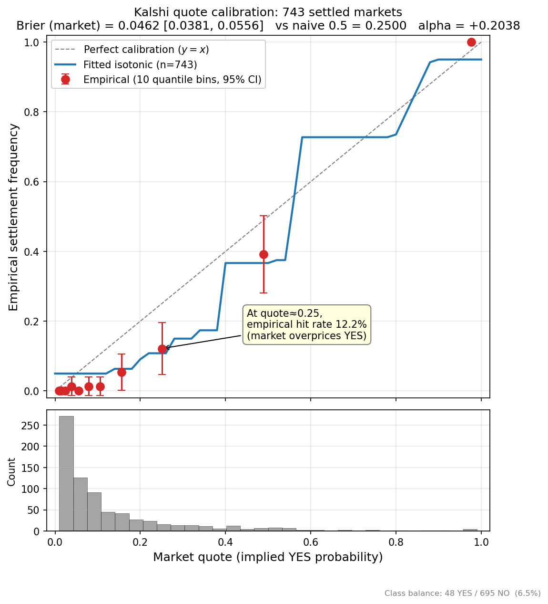

# KalshiQuant

A real-time quantitative trading system for [Kalshi](https://kalshi.com)
prediction markets, built around the observation that prediction markets are
not just low-volume options markets — they're a different statistical object,
and the standard quant playbook needs to be re-derived for each piece.

> **For a 5-minute walk-through of what's interesting and where to look, read
> [`docs/WRITEUP.md`](docs/WRITEUP.md).**



The figure above is the project's headline finding. **Kalshi quotes near 0.25
empirically settle YES at ~12%**, a 13-percentage-point overprice. Methodology
in [`docs/WRITEUP.md`](docs/WRITEUP.md), data in
[`data/calibration_training_data.json`](data/calibration_training_data.json),
walkthrough in [`notebooks/01_calibration_analysis.ipynb`](notebooks/01_calibration_analysis.ipynb).

---

## What's in the box

| | Where | Why it matters |
|---|---|---|
| **Fee-aware position sizing** | [`models/risk_model.py`](models/risk_model.py#L221) | The same nominal edge is profitable on a 0.20-priced contract and break-even on a 0.50-priced contract. Fees are a hard gate. |
| **Bernoulli copula CVaR** | [`models/risk_model.py`](models/risk_model.py#L457) | Gaussian VaR is wrong on bimodal binary contracts. Replaced with Monte Carlo on a Gaussian copula over Bernoulli draws. |
| **Isotonic calibration on settlement tape** | [`scripts/backfill_calibration.py`](scripts/backfill_calibration.py) | Trains on Kalshi's own historical settlements instead of waiting weeks for paper trades. 749 samples, Brier 0.046 [0.038, 0.056]. |
| **Vol-scaled triple-barrier exits** | [`engine/triple_barrier.py`](engine/triple_barrier.py) | López de Prado AFML ch.3, in price units (not percent) so the same multiplier produces tight stops on calm markets and wide stops on noisy ones. |
| **Heston stochastic-vol pricer** | [`models/heston.py`](models/heston.py) | For binary contracts <48h to expiry where lognormal breaks down. Uses the Albrecher-trap form for numerical stability. |
| **Black-Litterman portfolio optimizer** | [`models/black_litterman.py`](models/black_litterman.py) | Adapted for binaries: prior π=0, view confidences map to Ω, leverage cap respects RiskModel. |
| **Static look-ahead bias scanner** | [`scripts/scan_lookahead.py`](scripts/scan_lookahead.py) | Found and fixed a real bug in `models/regime_detector.py:60` (volume rolling window included current bar). Gates the CI suite. |
| **Runtime `@no_lookahead` decorator** | [`analysis/no_lookahead.py`](analysis/no_lookahead.py) | Asserts that any feature function with an `as_of` argument doesn't peek at future-dated rows. |
| **Latency monitor on the signal loop** | [`engine/latency_monitor.py`](engine/latency_monitor.py) | Found that the parlay pricer is 97% of the signal cycle. Without it I'd have guessed wrong. |
| **End-to-end decision pipeline** | [`engine/integrated_decision.py`](engine/integrated_decision.py) | Composes every gate (calibration → Polymarket → BL → CVaR) on a single market with a full trace. |

---

## Three findings, with numbers

### 1. The calibration curve above

749 settled markets. **Brier 0.0462 [95% CI 0.0381, 0.0556]** vs naive 0.25.
Bootstrap CI from 1000 resamples. The market is meaningfully better than naive
but systematically over-confident in the 0.20-0.30 range. Full analysis in
[`notebooks/01_calibration_analysis.ipynb`](notebooks/01_calibration_analysis.ipynb).

### 2. Naive mean-reversion strategies lose money

| Strategy | trades | hit_rate | avg P&L/contract | conclusion |
|---|---|---|---|---|
| `midpoint` (fade non-50) | 725 | 4.1% | **−$0.081** | Falsified |
| `distance` (fade extremes) | 673 | 2.5% | **−$0.075** | **Worse** |
| `calibrator` (use the curve) | 91 | 92% | **+$0.115** | Positive control |

The directionality is unambiguous: **the further a Kalshi market is from 0.50,
the more accurate it is on average.** Full writeup with caveats in
[`docs/NEGATIVE_RESULTS.md`](docs/NEGATIVE_RESULTS.md).

### 3. The signal loop bottleneck is the parlay pricer, not the model

```
Latency: total=43941ms
  external_feeds = 1251ms
  live_ensemble  =   25ms     <-- the actual model inference
  parlay_pricer  = 42662ms    <-- 97% of total
  execution      =    1ms
```

Found via the latency monitor I wired into the signal loop *before* I knew I
needed it. The model itself runs in 25ms; everything else is data fetching and
combinatorics.

---

## Quality gates

```bash
python -m pytest tests/ -q                          # 160 tests passing
python -m scripts.scan_lookahead --severity WARNING  # static look-ahead scan
python -m scripts.data_quality_report                # daily health check
```

The look-ahead scanner has a regression test
([`tests/test_lookahead_scanner.py:test_codebase_is_clean`](tests/test_lookahead_scanner.py))
that fails the suite if any new WARNING-level finding appears in the codebase
— so this can't silently regress.

---

## Reproducing the headline numbers

```bash
# 1. Pull settled markets and fit the calibrator
python -m scripts.backfill_calibration --max-pages 25

# 2. Generate the reliability diagram
python -m scripts.plot_calibration

# 3. Run the three strategies in the negative-results table
python -m scripts.replay_settled --strategy midpoint
python -m scripts.replay_settled --strategy distance
python -m scripts.replay_settled --strategy calibrator

# 4. Inspect the daily health report
python -m scripts.data_quality_report
```

Every script logs its full params + metrics to `data/experiments.jsonl` via
[`analysis/experiment_tracker.py`](analysis/experiment_tracker.py), which uses
MLflow if installed and falls back to JSONL otherwise.

---

## Reading order

1. **[`docs/WRITEUP.md`](docs/WRITEUP.md)** — the 5-minute narrative version
   of this README. The single most important document.
2. **[`docs/figures/calibration_curve.png`](docs/figures/calibration_curve.png)** — the headline visual.
3. **[`docs/NEGATIVE_RESULTS.md`](docs/NEGATIVE_RESULTS.md)** — what didn't work
   and what it falsifies.
4. **[`docs/BIBLIOGRAPHY.md`](docs/BIBLIOGRAPHY.md)** — every paper that
   informed a piece of the codebase.
5. **[`notebooks/01_calibration_analysis.ipynb`](notebooks/01_calibration_analysis.ipynb)** —
   the calibration analysis end-to-end with prose between cells.
6. **[`engine/integrated_decision.py`](engine/integrated_decision.py)** — the
   single file that ties every gate together. Read this and you understand
   the project's thesis.
7. **[`models/risk_model.py`](models/risk_model.py)** — the most quant-dense
   file (fee model, sizing, CVaR copula, calibrator).

---

## Status

- 160 tests passing
- Look-ahead bias scanner clean
- Server runnable against the live Kalshi WebSocket (`uvicorn server.main:app`)
- Calibrator fitted on 749 real samples and live in `RiskModel`
- Live trading **disabled by default** — paper mode only until paper P&L is
  positive on a non-trivial sample. There's a switch in [`server/main.py`](server/main.py)
  but I haven't flipped it.

---

## Stack

| Layer | Tech |
|---|---|
| Backend | Python 3.11, FastAPI, asyncio, WebSockets |
| ML | scikit-learn (isotonic regression), XGBoost, hmmlearn, scipy |
| Data | Pandas, NumPy, sqlite3 (positions), JSONL (experiments) |
| Frontend | Next.js 14, TypeScript, Tailwind, lightweight-charts |
| External feeds | CoinGecko, Yahoo Finance, FRED, Kraken (BTC backup), Polymarket (read-only) |

---

## License

MIT. See [`LICENSE`](LICENSE).

---

## A note on what this project is for

This is an independent research / portfolio project demonstrating quant
engineering on prediction markets. It is **not** a funded trading system, it
is **not** running with real capital, and the README, the writeup, and the
test suite all reflect that honestly. The point is to show that the right
kind of work was done with the right kind of discipline — not to claim alpha
that hasn't been proven on real markets.
